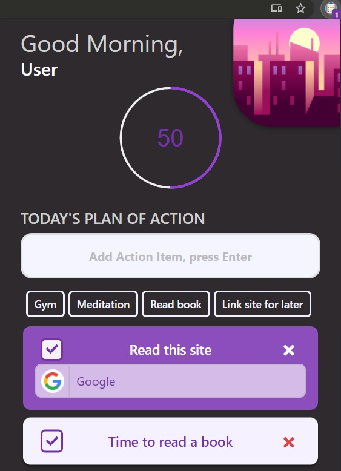
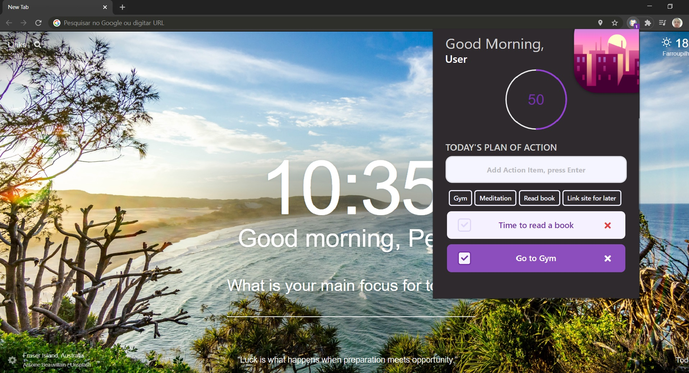
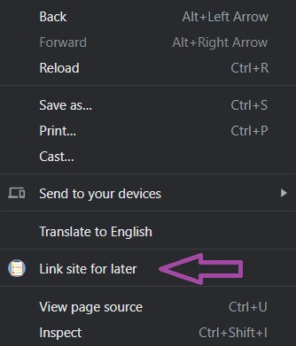

<h1 align="center">
    
    <h2 align="center">Daily Planner</h2>
</h1>

<h4 align="left"> 
An awesome way to plan your day and motivate you to take action! 
Organize your day and take action  

Daily Planner was built for you to very easily add your daily action 
It was built for you to feel rewarded as you go about checking off your tasks  
It was built for you to feel accomplished  
It was built as a dark mode so it feels more smoth 

Use Daily Planner for Chrome to:
- Motivate yourself as you complete your tasks
- Organize your day
- Make sure you are making progress
- Add websites as action items to visit later
- Easily complete tasks
- View your action progress on the day

I hope you enjoy!
</h4>

## Content

<h1 align="center">
    
</h1>

<h1 align="center">
    
    
You can right click your current page and link it for later

</h1>

 
 
 

## Autor of this version

- [@lucas-sachet](https://github.com/lucas-sachet)
